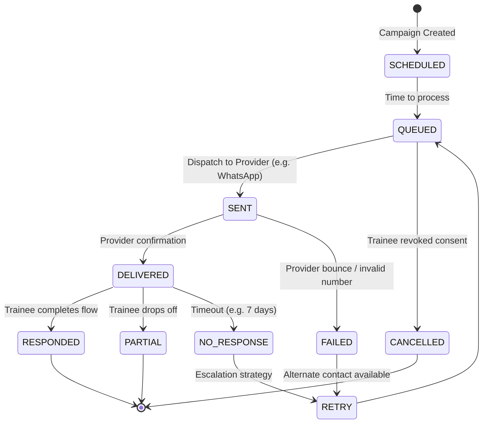
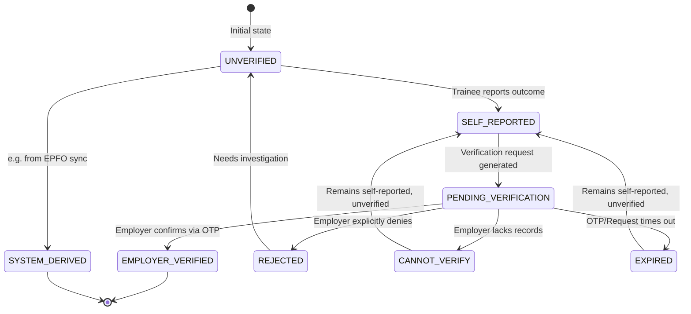

# State Machines

## 1. Follow-up State Machine

This state machine governs the lifecycle of a scheduled follow-up for a trainee.

## 2. Outcome Verification State Machine

This state machine tracks the trustworthiness of a reported employment outcome.

